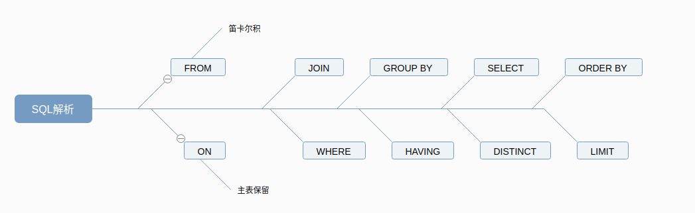
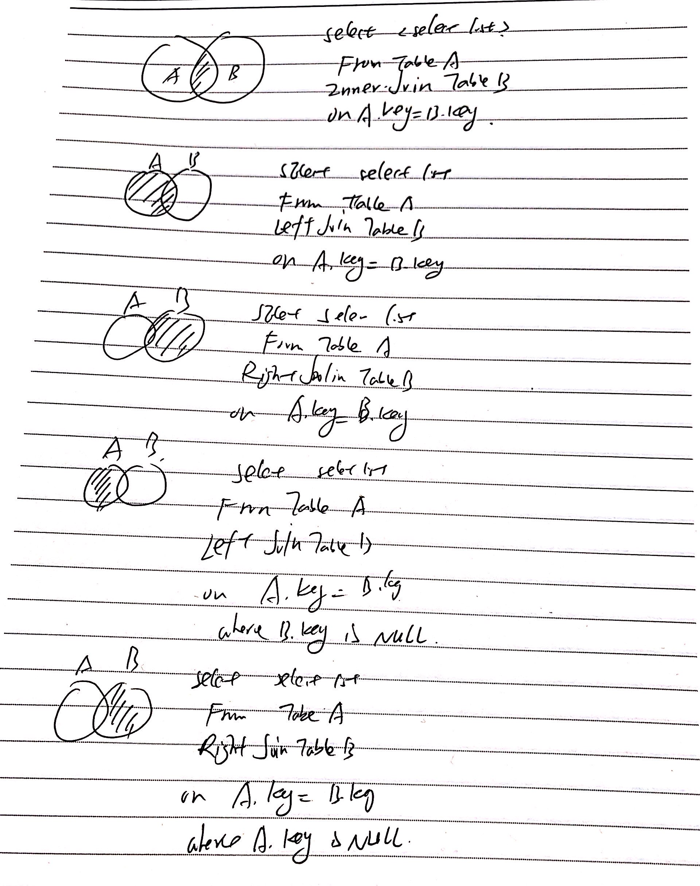

# MySQL四层架构

## 1.连接层

最上层是一些客户端和连接服务，包含本地sock通信和大多数基于客户端/服务端工具实现的的类似tcp/ip的通信。主要完成一些类似于连接处理、授权认证及相关的安全方案，在该层上引入了线程池的概念，为通过认证安全接入的客户端提供线程。同样在该层上可以实现基于SSL的安全认真。服务器也会为安全接入的每个客户端验证它所具有的操作权限。

## 2.服务层

第二层架构主要完成大多数的核心服务功能，如SQL接口，并完成缓存的查询，SQL的分析和优化及部分内置函数的执行。所有缓存储引擎的功能也在这一层实现，如过程、函数等。在该层，服务器会解析查询并创建相应的内部解析树，并对其完成相应的优化如确定查询表的顺序，是否利用该索引等，最后生成相应的执行操作。如果是select语句，服务器还会查询内部的缓存。如果缓存空间足够大，这样在解决大量读操作的环境中能够很好的提升系统的性能。

## 3.引擎层

存储引擎层，存储引擎真正的负责了MySQL中数据的存储和提取，服务器通过API与存储引擎进行通信。不同的存储引擎具有的功能具有的功能不同，这样我们可以根据自己的实际需要进行提取。

## 4.存储层

数据存储层，主要是将数据存储在运行于裸设备的文件系统之上，并完成与存储引擎的交互。


## 存储引擎

### 1. 如何用命令查看

```SQL
SHOW ENGINES;
SHOW VARIABLES LIKE '%storage_engine%';
```

### 2. MyISAM和InnoDB

|对比项|MyISAM|InnoDB|
|-----|------|------|
|主外键|不支持 |支持|
|事务|不支持|支持|
|行表锁|表锁，即使操作一条记录也会锁住整个表，不适合高并发的操作|行锁。操作时只锁一次，不对其他行有影响，适合高并发的操作|
|缓存|只缓存索引，不缓存数据|不仅缓存索引还要缓存真实数据，对内存要求较高，而且内存大小对性能有决定性的影响|
|表空间|小|大|
|关注点|性能|事务|
|默认安装|Y|Y|

### 3.索引优化

- 性能下降SQL慢，执行时间长，等待时间长
    1. 查询语句写的烂
    2. 索引失效
    3. 关联查询太多join(设计缺陷或不得已的需求)
    4. 服务器调优及各个参数设置(缓冲、线程数等)

### 4.常见的join查询

1. SQL执行顺序

- 手写
- 机读
- 总结






