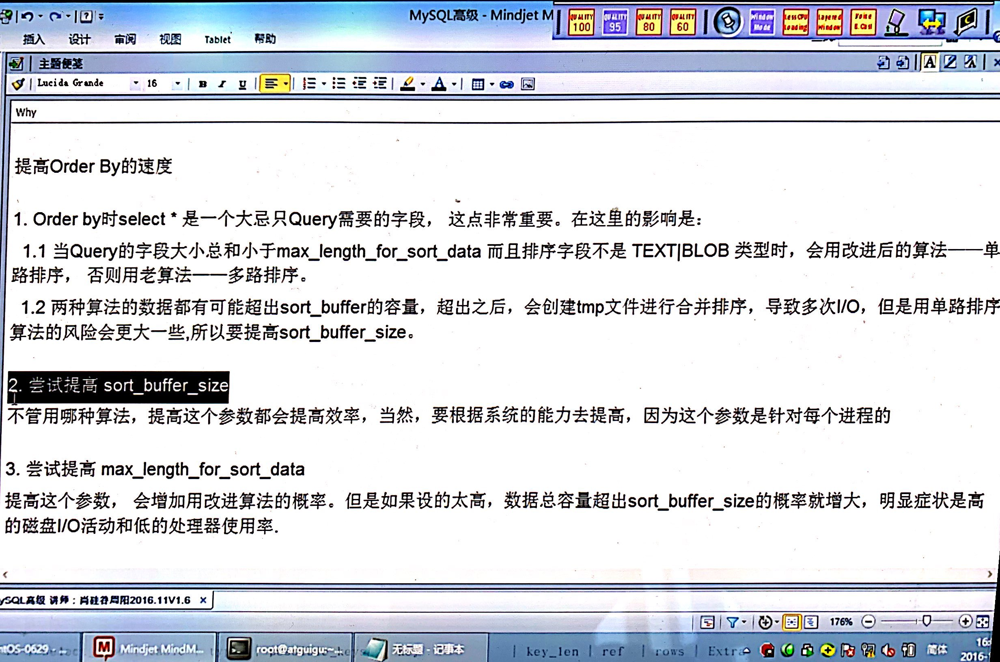
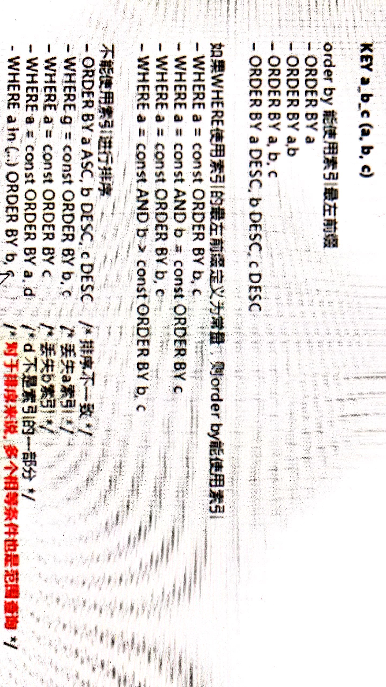

# 查询截取分析

## 1.explain

### 分析

1. 观察，至少跑一天，看看生产的慢SQL情况。
2. 开启慢查询日志，设置阀值，比如超过5秒中的就是慢SQL，并将它抓取出来。
3. explian + 慢SQL分析
4. show profile
5. 运维经理 or DBA, 进行SQL数据库服务器的参数调优

### 总结

0. 
1. 慢查询的开启并捕获
2. explain+慢SQL分析
3. show profile查SQL在ＭySQL服务器的执行细节和生命周期情况
4. SQL数据库服务器的参数调优

#### 查询优化

- 永远小表驱动大表，即晓得数据集驱动大的数据集

原理（RBO）

```SQL

select * from A where id in (select id from B)
#等价于
for select id from B
for select * from A where A.id = B.id

#当B表的数据集必须小于A表的数据集时，用in优于exists

select * from A where exists (select 1 from B where B.id = A.id)
#等价于
for select * from A
for select * from B where B.id = A.id;

#当A表的数据集小于B表的数据集是，用exists优于in。

```

- EXISTS
SELECT ... FROM table WHERE EXISTS(subquery)
该语法可以理解为：***将主查询的数据，放到子查询中做条件验证。根据验证结果（TRUE或FALSE）来决定主查询的数据结果是否得以保留***

- 提示
    1. EXISTS（subquery）只返回TRUE或FALSE，因此子查询中的SELECT*也可以是SELECT 1 或 SELECT 'X'，官方说法是实际执行时会忽略SELEC清单，因此没有区别
    2. EXIST子查询的实际执行过程可能经过了优化而不是我们理解上的逐条对比，如果担忧效率问题，可进行实际检验以确定是否有效率问题。
    3. EXISTS子查询往往也可以同条件表达式，其他子查询或者JOIN来替代，何种优化需要具体问题具体分析。

***注意 A表和B表的id都有index***

- order by 关键字优化
    1. ORDER BY子句，尽量用Index方式排序，避免使用FileSort方式排序
    2. MySQL支持两种方式的排序，FileSort和Index,Index效率高，它指MySQL扫描索引本身完成排序。FileSort方式效率较低。
    3. ORDER BY 满足俩情况，会使用Index方式排序：
        - ORDER BY 语句使用索引最左列
        - 使用where子句与ORDER BY 子句条件列组合满足索引最左前列
    4. 尽可能在索引列上完成排序操作，遵照索引建的最佳左前缀
    5. 如果不再索引列上，filesort有两种算法，mysql就要启动双路排序和单路排序：

    

- 小总结
    1. MySQL有两种排序方式：文件排序或扫描有序索引排序
    2. MySQL能为排序与查询使用相同的索引
    

- group by 关键字优化
    1. group by实质是先排序后进行分组，遵照索引建的最佳左前缀
    2. 当无法使用索引列，增大max_length_for_sort_data参数的设置+增大sort_buffer_size参数的设置
    3. where高于having,能写where限定的条件就不要去having限定了。
    