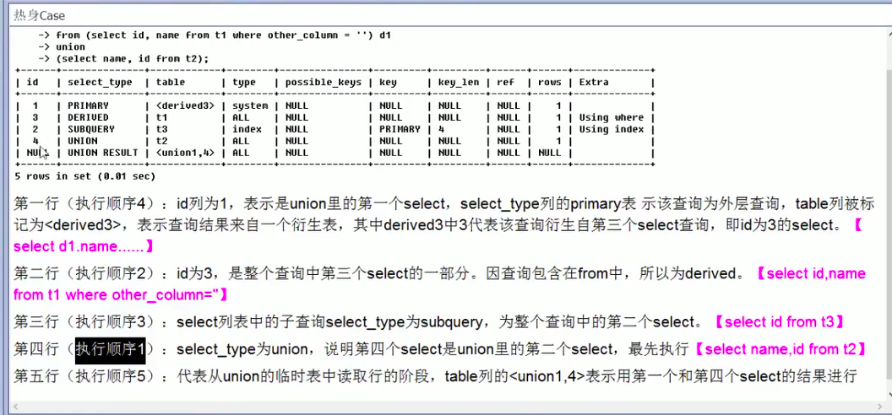

# 索引

## 定义

索引（Index）是帮助MySQL高效获取数据的数据结构。

***索引是数据结构***

索引的目的在于提高查询效率，类比字典，如果要查"mysql"，我要坑定需要定位到m字母，然后从下往上找到字母y，再找剩下的sql。

你可以简单的理解为***排好序的快速查找数据结构***

在数据之外，***数据库系统还维护着满足特定查找算法的数据结构***，这些数据结构以某种方式引用（指向）数据，这样就可以在这些数据结构上实现高级查找算法。这种数据结构，就是索引。

一般来说索引本身也很大，不可能全部存储在内存中，因此索引往往以索引文件的形式存储在磁盘上。

## 优势

- 类似大学图书馆i建书目索引，提高数据检索的效率，降低数据库的IO成本
- 通过索引对数据进行排序，降低数据排序的成本，降低CPU的消耗

## 劣势

- 实际上索引也是一张表，该表保存了主键和索引字段，并指向实体表的记录，所以索引列也是要占用空间的
- 虽然索引大大提高了查询速度，同时却会降低更新表的速度，如对表进行INSERT、UPDATE和DELETE。因为更新表时，MySQL不仅要保存数据，好要保存一下索引文件每次更新添加了索引列的字段，都会调整因为更新所带来的键值变化后的索引信息。

- 索引只是提高效率的一个因素，如果你的MySQL有大数据量的表，就需要花时间研究建立最优秀的索引，或优化查询

## 分类

- 单值索引 即一个索引只包含单个列，一个表可以有多个单列索引
- 唯一索引 索引列的值必须唯一，但允许有空值
- 复合索引 即一个索引包含多个列

## 基本语法

```SQL
//创建
CREATE [UNIQUE] INDEX indexName ON myTable(columnanme(length));
ALTER myTable ADD [UNIQUE] INDEX [indexName] ON (columnname(length));
//删除
DROP INDEX [indexName] ON myTable
//查看
SHOW INDEX FROM table_name
```

### 有四种方式添加数据表的索引

```SQL
//该语句添加一个主键，这意味着索引值必须是唯一的，且不能为NULL。
ALTER TABLE tbl_name ADD PRIMARY KEY(column_list);
//这条语句创建索引的值必须是唯一的（除了NULL外，NULL可能会出现多次）
ALTER TABLE tbl_name ADD UNIQUE index_name(column_lis);
//添加普通的索引，索引值可出现多次
ALTER TABLE tbl_name ADD INDEX index_name(column_list);
该语句指定了索引为FULLTEXT， 用于全文索引
ALTER TABLE tbl_name ADD FULLTEXT index_name(column_list);
```

## 索引结构

- Btree
- Hash
- full-text
- R-Tree

## 哪些情况需要创建索引

1. 主键自动建立唯一索引
2. 频繁作为查询条件的字段应该创建索引
3. 查询中与其他表关联的字段，外键关系建立索引
4. 频繁更新的字段不适合创建索引-因为每次更新不单单是更新了记录还会更新索引
5. WHERE条件里用不到的字段不创建索引
6. 单键/组合索引的选择问题？（高并发 组合）
7. 查询中排序的字段、排序字段若通过索引去访问将大大提高排序速度
8. 查询中统计或者分组字段

## 哪些情况不需要创建索引

1. 表记录太少
2. 经常增删改的表
3. 注意，如果某个数据列包含许多重复的内容，为它建立索引就没有太大的实际效果。

## 性能分析

### MySQL Query Optimizer

### MySQL常见瓶颈

- CPU
- IO
- 服务器硬件的性能瓶颈

### Explain

使用EXPLAIN关键字可以模拟优化器执行SQL查询语句，从而知道MySQL是如何处理你的SQL语句的。分析你的查询语句或是表结构的性能瓶颈。

### 能干嘛

- 表的读取顺序 id
- 数据读取操作的操作类型 select_type
- 那些索引可以使用 possible_keys
- 那些索引被实际使用 key
- 表之间的引用 ref
- 每张表有多少行被优化器查询 rows

#### 怎么玩

Explain + SQL语句

包含的信息

|id|select_type|table|partitions|type|possible_keys|key|key_len|ref|rows|filtered|Extra|
|--|-----------|-----|----------|----|-------------|---|-------|---|----|--------|-----|

#### 字段解释

- id select查询的序列号，包含一组数字， 表示查询中执行select子句或操作表的顺序，分为三种情况：
    1. id相同，执行顺序由上之下
    2. id不同，如果是子查询，id序号会递增，id值越大优先级越高，越先被执行
    3. id相同不同，同时存在 - id如果相同，可以认为是一组，从上往下顺序执行；在所有组中，id越大，优先级越高，越先执行

- select_type
    1. 有哪些：
        - SIMPLE 简单的select查询，查询中不包括子查询或者UNION
        - PRIMARY 查询中若包含任何复杂的子部分，最外层查询则被标记为PRIMARY
        - SUBQUERY 在SELECT或WHERE列表中包含了子查询
        - DERIVED 在FROM列表中包含的子查询被标记为DERIVED（衍生），MySQL会递归执行这些子查询，把结果放在临时表里
        - UNION 若第二个SELECT出现在UNION之后，则被标记为UNION；若UNION包含在FROM子句的子查询中，外层SELECT将被标记为：DERIVED
        - UNION RESULT 从UNION表获取结果的SELECT

- table  显示这一行的数据是关于哪张表的
- type 访问类型
    1. 有哪些
        - ALL Full Table Scan, 将遍历全表以找到匹配的行
        - index Full Index Scan, index与ALL区别为index类型只遍历索引树。这通常比ALL快，因为索引文件通常比数据文件小。（也就是说虽然all和index都是读全表，但index是从索引中读取的，而all是从硬盘中读的）
        - range 只检索给定范围的行，使用一个索引来选择行。key列显示使用了哪个索引；一般就是在你的where语句中出现了between、<、>、in 等的查询；这种范围扫描索引比全表扫描要好，因为它只需要开始于索引的某一点，而结束于另一点，不用扫描全部索引。
        - ref 非唯一性索引扫描，返回匹配某个单独值的所有行。本质上也是一种索引访问，它返回所有匹配某个单独值的行，然而，它可能会找到多个符合条件的行，所以他应该属于查找和扫描的混合体。
        - eq_ref 唯一性索引扫描，对于每个索引键，表中只有一条记录与之匹配。常见于主键或唯一索引扫描。
        - const 表示通过索引一次就找到了，const用于比较primary key或unique索引。因为只匹配一行数据，所以很快。如将主键置于WHERE列表中，MySQL就能将该查询转换为一个常量。
        - system 表只有一行记录（等于系统表），这是const类型的特例，平时不会出现，这个也可以忽略不计
        - NULL
    2. 显示查询使用了何种类型，从最好到最差依次为： system > const > eq_ref > ref > range > index > ALL
    3. ***一般来说，得保证查询至少达到range级别，最好能达到ref***
- possible_keys（理论上使用哪些索引） 显示可能应用在这张表中的索引，一个或多个。查询涉及到的字段上若存在索引，则该索引将被列出，***但不一定被查询实际使用***。
- key（实际上使用哪些索引） 实际使用的索引。如果为NULL，则没有使用索引；查询中若使用了覆盖索引，则该缩影仅出现在key列表中。
- key_len 表示索引中使用的字节数，可通过该列计算查询中使用的索引的长度。在不损失精确性的情况下，长度越短越好；key_len显示的值为索引字段的最大可能长度，***并非实际使用长度***，即key_len是根据表定义计算而得，不是通过表内检索出的。
- ref 显示索引的哪一列被使用了，如果可能的话，是一个常数。哪些列或常量被用于查找索引列上的值。
- rows 根据表统计信息及索引选用情况，大致估算出找到所需的记录所需要读取的行数
- Extra 包含不适合在其他列中显示但十分重要的额外信息：
    1. Using filesort(九死一生) 说明mysql会对数据使用一个外部的索引排序，而不是按照表内的索引顺序进行读取。MySQL中无法利用的索引完成的排序操作称为"文件排序"。
    2. Using temporary（十死无生） 使用了临时表保存中间结果，MySQL在对查询结果排序时使用临时表。常见于排序order by和分组查询group by。
    3. Using index （发了）
        - 表示相应的select操作中使用了覆盖索引（Covering Index）,避免访问了表的数据行，效率不错！
        - 如果同时出现using where,表明索引被用来执行索引键值的查找
        - 如果没有同时出现using where, 表明索引用来读取数据而非执行查找动作。
        - ***覆盖索引（Covering INdex）*** 索引覆盖
            1. 理解方式一：就是select的数据列只用从索引中就能取得，不必读取数据行，MySQL可以利用索引返回select列表中的字段，而不必根据索引再次读取数据文件，换句话说***查询列要被所建的索引覆盖***。
            2. 如果要使用覆盖索引，一定要注意select列表中只取出需要的列，不可select*
            3. 如果将所有字段一起做索引会导致索引文件过大，查询性能下降。
    4. Using where 表明使用了where过滤
    5. using join buffer 使用了连接缓存
    6. impossible where where子句的值总是false，不能用来获取任何元素
    7. select tables optimized away 在没有group by子句的情况下，基于索引优化MIN/MAX操作或者对于MyISAM存储引擎优化COUNT（*）操作，不必等到执行阶段在进行计算，查询执行计划生成的阶段即完成优化。
    8. distinct 优化distinct操作，在找到第一匹配的元组后即停止找同样值的动作。

### 热身case


