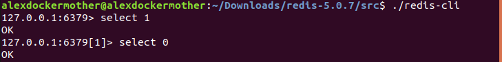
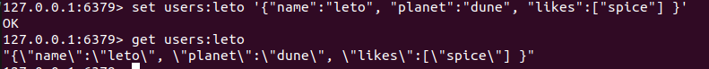
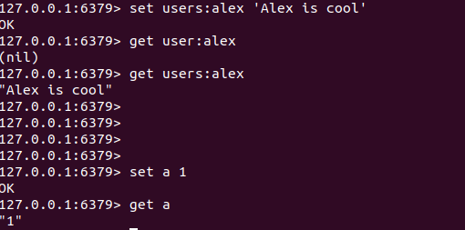

# The Commands

## Datebases

In Redis, databases are simply identify by a number.Default is 0.
If you would like to change the database, just in the client: `select index`, index means the database.

## Keys and Values

Keys are how you identify pieces of data.

Values represent the actual data with the key. They can be anything.

