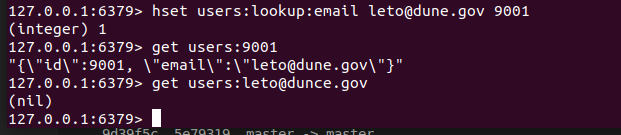
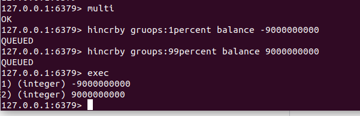
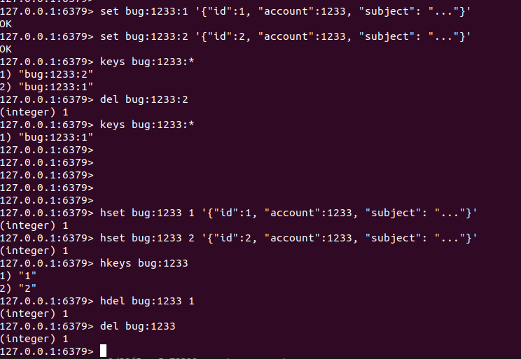

# Leveraging Data Structure

## Big O Notation

>Big O notaion in the form of O(n) or O(1).\
In Redis, it's used to tell us ***how fast a command*** is based on the number of items we are dealing with.

- sismember : tell us if a value belongs to a set is ***O(1)***

- zadd is a ***O(log(N))*** command, where N is the number of elements already in the sorted set.

- ltrim is ***O(N)***, using ltrim to remove 1 item form a list of millions will be fasted than using ltirm to remove 10 items from a list of thousands.

- zremrangebyscore: remove elements from a sorted set with a score between a minimum and a maximum value  - is ***O(log(N)+M)***, N is the number of total elements in the set and M is the number of elements to be removed, ***M*** is more significant than ***N***.

- sort : O(N+M*log(M))

- remaining common ones are O(N^2) anc O(C^N)

>值得指出的是，Big O notation 说的是最坏情况。比如我们说某操作的复杂性是 O(N)，那我们就有可能一开始就找到它或者在最后才找到它。

## Pseudo Multi Key Queries

### Case1 - query the same value by different keys

***THis is bad***

Because it's a nightmare to manage and it takes twice the amount of memory.
>It woudld be nice if Redis let you link one key to another ***but it doesn't***.\
>Using a ***hash***, we can remove the need for duplication.

`users:lookup:email leto@dunce.gov`

>means get a user by email

## Referene and Indexes

## Round Trips and Pipelining

>making frequent trips to the server is a common pattern in Redis.\
>Redis also support pipeline.\
>Normally when a client sends a request to Redis it waits for the reply before sending the next request.\
>With pipelining you can send a number of requests without waiting for their response.

## Transactions

## Keys Anti-Pattern

The keys command.\
THis command takes a pattern and finds all the matching keys.\
***It should never be used in production code because it doses a `liner` scan through all the keys looking for matches***

The following picture shows that:

比如说你在做一个 bug 跟踪服务。每个账户有字段 id ，并且你想把每个 bug 存到一个字符串值里面去，对应的 key 看起来像 bug:account_id:bug_id。如果你需要找出一个账号下所有的 bug (显示它们，或者删除账号之后把 bug 一同删除),你应该试试 使用 keys 命令:

`keys bug:1233:*`

好一点的解决案是用哈希结构。就像我们可以用哈希来暴露二级索引那样，所以我们也可以用它来组织我们的数据:

为了取得一个账户下的所有 bug 标识符，我们只需要调用 hkeys bugs:1233。要删除指定 bug 我们可以 hdel bugs:1233 2，要删除账户的话我们可以通过 del bugs:1233 来删除 key。

>The real key is to understand the fundamental data structures and to get a sense for how they can be used to achieve things beyond your initial perspective
