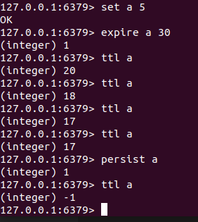
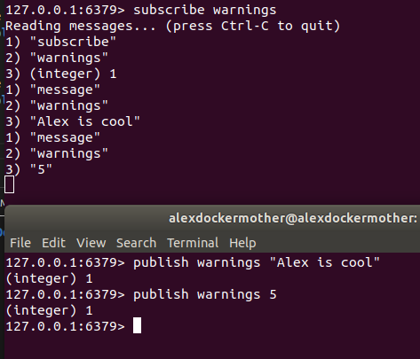
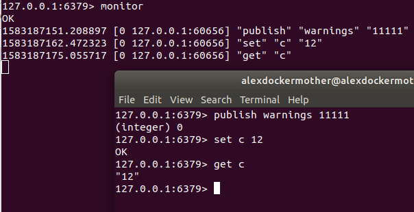
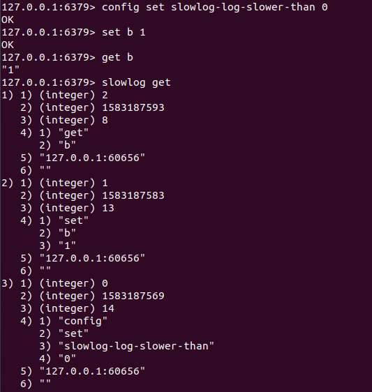

# Beyond The Data Structures

## Expiration

Redis allows you to mark a key for expiration. You can give it an absolute time in the form of ***Unix timestamp*** (seconds sine January 1, 1970) or a time to ***live in seconds***.

`expire pages:about 30`
> will delete the key (and associated value) after 30 seconds.

`expire pages:about 1356933600`
> will do the same at 12:00 a.m. December 31st, 2012

You can ***ttl*** to find out how long an item can live and you can remove the expiration on a key via ***persist***

There is a special string command, ***setex*** which let you set a string and specify a time to live in a single a ***atomic*** time.

>setex \<key> \<time> \<value>

## Publication and SubScriptions

***blpop*** return and remove the ***first*** element from the list for **blocks** until one is available.

***brpop*** return and remove the ***last*** element from the list for **blocks** until one is available.

***subscribe*** and ***publish***

you can subscribe to multiple channels
>(subscribe channel1 channels2 ....)

or subscribe to a pattern of channels
>(psubscribe warnings:*)

you can use ***unsubscribe*** and ***punsubscribe** commands to stop listen

> publish command return the value 1. This indicates the number of clients that received the message.

## Monitor and Slow Log

***monitor*** let you see what Redis is up to, great debuggng tool that gives you insight into how your application is interacting with Redis.

Redis has a ***slowlog*** which acts as a greate profiling tool. It logs any command which takes longer than a specified number of *microseconds*.

>slowlog get - get most recent logs\ 
>slowlog get \<len> - get the number of the recent logs

For each command you entered you should see four parameters:

- A auto-incrementing id
- A unix timestamp for when the command happened
- The time, in microseconds, it took to run the command
- The command and its parameters
