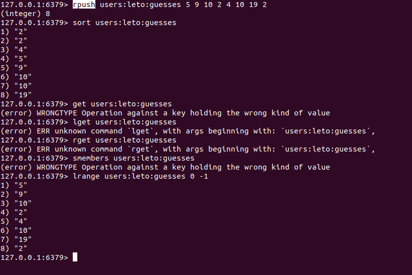
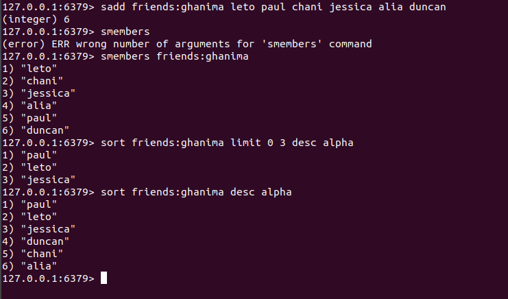
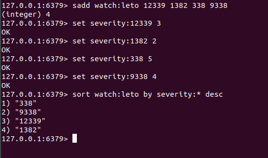
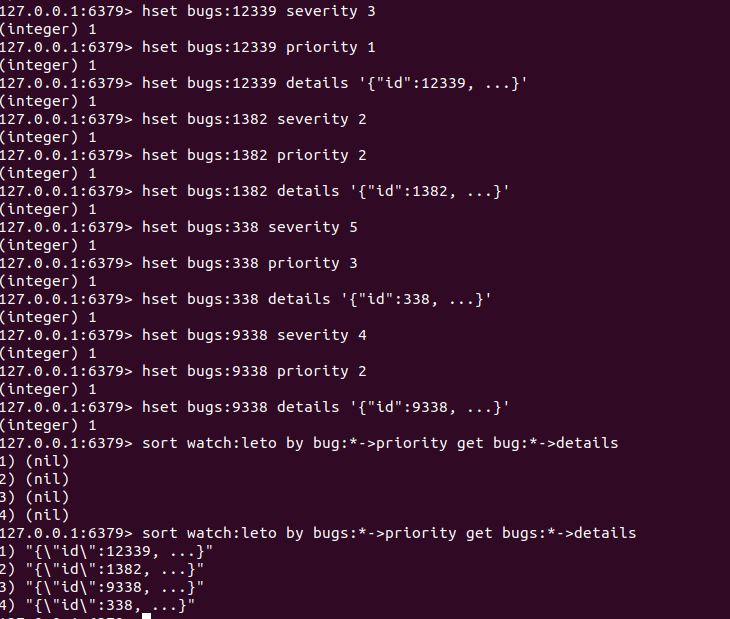
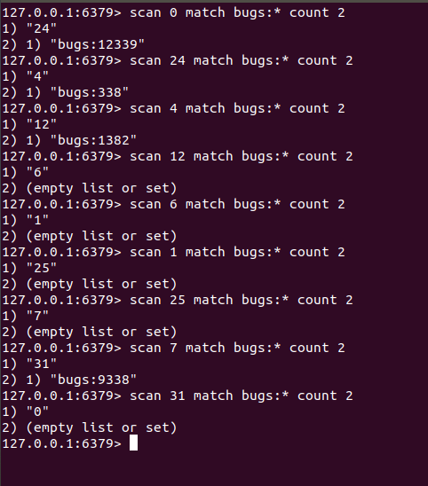

# Beyond The Data Structures

## Expiration

Redis allows you to mark a key for expiration. You can give it an absolute time in the form of ***Unix timestamp*** (seconds sine January 1, 1970) or a time to ***live in seconds***.

`expire pages:about 30`
> will delete the key (and associated value) after 30 seconds.

`expire pages:about 1356933600`
> will do the same at 12:00 a.m. December 31st, 2012

You can ***ttl*** to find out how long an item can live and you can remove the expiration on a key via ***persist***

There is a special string command, ***setex*** which let you set a string and specify a time to live in a single a ***atomic*** time.

>setex \<key> \<time> \<value>

## Publication and SubScriptions

***blpop*** return and remove the ***first*** element from the list for **blocks** until one is available.

***brpop*** return and remove the ***last*** element from the list for **blocks** until one is available.

***subscribe*** and ***publish***

you can subscribe to multiple channels
>(subscribe channel1 channels2 ....)

or subscribe to a pattern of channels
>(psubscribe warnings:*)

you can use ***unsubscribe*** and ***punsubscribe** commands to stop listen

> publish command return the value 1. This indicates the number of clients that received the message.

## Monitor and Slow Log

***monitor*** let you see what Redis is up to, great debuggng tool that gives you insight into how your application is interacting with Redis.

Redis has a ***slowlog*** which acts as a greate profiling tool. It logs any command which takes longer than a specified number of *microseconds*.

>slowlog get - get most recent logs\
>slowlog get \<len> - get the number of the recent logs

For each command you entered you should see four parameters:

- A auto-incrementing id
- A unix timestamp for when the command happened
- The time, in microseconds, it took to run the command
- The command and its parameters

## Sort

***One of Redis's most powerful commands is sort.***

(sorted set are ordered by score, not the members within the set).

>Redis willl substitude the * in our pattern(identified var by) with the values in our list/set/sorted set.\
This will create the kay name that Redis will query for the actual values to sort by.

## Scan

在上一章，我们看到了如何使用 keys 命令，它很有用，但是不应该用到生产环境中。

scan 命令，它对生产环境是无害的。

一次调用 scan 无需返回所有匹配结果。没什么奇怪的，就是一个被分页的结果;

但是, scan 返回的结果条数不定，它不能被精确的控制。

你可以用 count 选项，默认是 10，不过它完全有可能拿到比指定的 count 更多或更少的结果。

第一次调用 scan ，指定 0 作为游标。下面我们看看一个初始调用 scan 的例子，它指定了匹配模式 (可选) 和计数 (可选):

作为返回值的一部分，scan 返回下一个可用游标。或者，返回 0 来表示结果扫描结束。注意下一个游标的值，不代表结果的个数，也不是服务端可用的任何东西。

一个典型的流程应该看起来像这样:

***一个空结果集并不意味着没有其他的结果存在。只有一个 0 游标，才意味着没有更多的结果。***

***这有两点需要牢记。***

1. scan 可以多次返回相同的 key 。你需要自己处理(比如说保存一个已有值集合)。

2. scan 只保证在迭代的整个持续过程中的存在值会被返回。如果在迭代中有值被添加或者被删除，新值可能被返回，***旧值可能被忽略***。再强调一次，这就是 scan 所谓的无状态; 它不会对存在值做快照(就像你在许多数据库中看到的那样，提供了强一致性保证)，***仅仅是遍历同一块内存空间，不管空间有没有发生变更***。

除了 scan ,还添加了 hscan, sscan 和 zscan 命令。这可以让你遍历哈希，集合和有序集。为什么需要这些命令？好吧，***就像因为 keys 堵塞了其他所有的调用***，于是有了哈希命令 hgetall 和集合命令 smembers。如果你想遍历一个非常大的哈希或集合，你可以考虑用这些命令。zscan 看起来没什么用，因为对一个有序集合分页，通过 zrangebyscore 或 zrangebyrank 已经可以达到目的。不过，如果你真的想全遍历一个大的有序集合，zscan 也不是没有价值。
