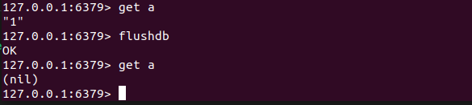
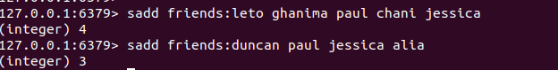

# The Data Structure

***how to erase all the values in the database***

## Strings

- strlen \<key>: get the lengths of a key's value
- getrange \<key> \<start> \<end>: returns the specified range of a value
- append \<key> \<value>: appends the value to the existing value(or creates if it doeesn't exist already)

- incr \<key> : add ***1*** to the key's value if key's value is an integer(if no key, create it and set original value to 0 and then add 1

- incrby \<key> \<value> : add ***value*** to the key's value if key's value is an integer(if no key, create it and set original value to 0 and then add value

- 

- decr \<key> : minus ***1*** to the key's value if key's value is an integer(if no key, create it and set original value to 0 and then minus 1

- decrby \<key> \<value> : minus ***value*** to the key's value if key's value is an integer(if no key, create it and set original value to 0 and then minus value

- 

## Hashes

The important difference is that they provide an extra level of indirection: ***field***

hset \<key> \<field> \<value> and hget \<key> \<field>:

We can also:

- set multiple fields at once( hmset \<key> \<field1> \<value > \<field2> \<value>)
- get multiple fields at once( hmget \<key> \<field1> \<field2>)
- get all fields and values( hgetall \<key>)
- list all the fields( hkeys  \<key>)
- delete a specific field( hdel \<key> \<field>)

- 

> The benefit would be the ability to pull and update/delete specific pieces of data, without having to get or write the entire value

## Lists

>Lists let you store and manipulate an array of values for a given key

1. we push a new user at the front of the list
2. we trim it so that it only contains the last 50 users.

## Sets

>Sets are used to store unique and provide a number of set-based operations, like unions.

 1. sadd \<key>  \<members>
    
 2. sismember \<key> \<member>
    
 3. sinter \<keys> (unions)
    
 4. store the result at new key: sinterstore \<newkey> \<key1> \<key2>
    

## Sorted Sets

>Most powerful data structure.\
>If hashes are like strings but with fields, then sorted sets like sets but with a ***score***

The ***socre*** provides sorting and ranking capabilities

1. initial a sorted set
2. find out how many friends duncan with a score of 90 or over
3. how about chan's rank(fro high to low)

## Summary

>You can often do more than you first realize.
