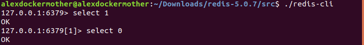

# The General

## Datebases

In Redis, databases are simply identify by a number.Default is 0.
If you would like to change the database, just in the client: `select index`, index means the database.

## Keys and Values

Keys are how you identify pieces of data.

Values represent the actual data with the key. They can be anything.

***Keys are everything***

***Values are nothing***

Redis doesn't allow you to query an object's value.

By default, save the database every **60 seconds** if **1000** or moe keys havs changed all the way to **15 minutes** if **9** or less keys are changed.

- Keys are strings which identify pieces of data

- Values are arbitrary byte arrays that Redis doesn't care about

- Redis exposes(and is implemented as) five specialized data structures

- Combined, the above make Redis fast and easy to use, but not suitable for every scenario
