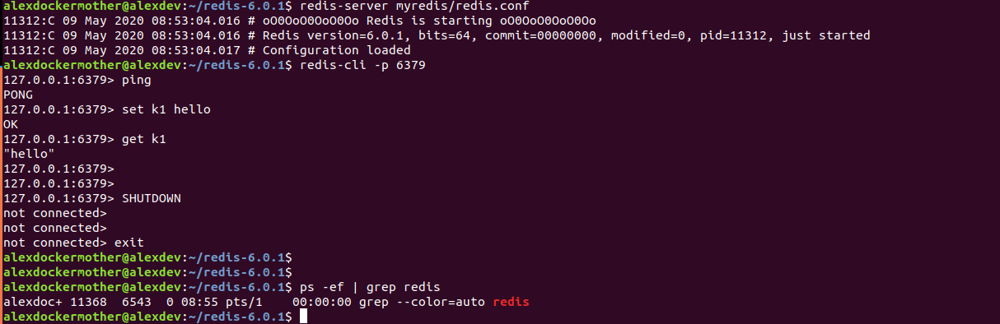
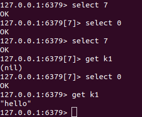

# Redis

## 入门概述

1. 是什么？
    - Redis： REmote DIctionary Server
    - 是一个高性能的key/value分布式内存数据库，基于内存运行并支持持久化的NoSQL数据库

2. 能干嘛？
    - 支持数据持久化，可以将内存中的数据保持在磁盘中，重启的时候可以再次加载进行使用
    - 不仅仅支持简单的key-value类型的数据，同时还提供list,set, zset, hash等数据结构的存储
    - 支持数据备份，即master-slave模式的数据备份

3. 去哪下？

4. 怎么玩？
    - 数据类型、基本操作和配置
    - 持久化和复制， RDB/AOF
    - 事务的控制
    - 复制

## 杂项基础知识

- 单进程
- 默认16个数据库,类似数组下表从零开始，初始默认使用零号库
- Select命令切换数据库

- Dbsize查看当前数据库的key数量

- flushdb 清空当前数据库
- flushall 清空所有数据库
- 统一密码管理，16个库都是同样密码，要么都OK要么一个也连接不上
- Redis索引从零开始
- 默认端口是6379

## Redis数据类型

### 5大数据类型

    - String
    - Hash
    - List
    - Set
    - Zset: 每一个元素都会关联一个double类型的分数，通过这个分数来从小到大排序。成员唯一，但分数却可以重复

### 哪里去获得redis常见数据类型操作命令

    - Http://redisdoc.com/

### Redis键（Key)

    del key
    dump key：序列化给定key，返回被序列化的值
    exists key：检查key是否存在
    expire key second：为key设定过期时间,以秒计算,可以不写second，默认为秒
    ttl key：返回key剩余时间,-1为永久,-2为失效
    persist key：移除key的过期时间，key将持久保存
    keys pattern：查询所有符号给定模式的key eg：keys *
    randomkey：随机返回一个key
    rename key newkey：修改key的名称
    move key db：移动key至指定数据库中 eg:move a 1
    type key：返回key所储存的值的类型

    kyes * 罗例的所有的key
    exists key的名字 判断某个key是否存在
    move key DBnum 当前库没有了 在DBnum中
    expire key 秒： 为给定的key设置过期时间
    ttl（time to live） key:查看还有多少秒过期， -1永不过期， -2表示已过期
    type key 查看你的key是什么类型

### Redis字符串（String）

    set key_name value：命令不区分大小写，但是key_name区分大小写
    setnx key value：当key不存在时设置key的值。（SET if Not eXists）,分布式锁的问题
    setex：创建一个key，并且设置他的过期时间
    get key_name
    getrange key start end：获取key中字符串的子字符串，从start开始，end结束
    setrange key offset value：设置从offset往后的值
    mget key1 [key2 …]：获取多个key
    getset key_name value：返回key的旧值,并设定key的值。当key不存在，返回nil
    strlen key：返回key所存储的字符串的长度
    incr key_name ：INCR命令key中存储的值+1,如果不存在key，则key中的值话先被初始化为0再加1
    INCRBY KEY_NAME 增量
    DECR KEY_NAME：key中的值自减一
    DECRBY KEY_NAME
    append key_name value：字符串拼接，追加至末尾，如果不存在，为其赋值

    ***单值单Value***

    set/get/del/append/strlen
    Incr/decr/Incrby/decrby 一定要是数字才能进行加减
    getrange/setrange
    setex(set with expire)键 秒/setnx(set if not exist)
    mset/mget/msetnx

### Redis列表（List）

    lpush key value1 [value2]：从左侧插入，右边的先出,相当于一个栈
    eg:lpush list 1 2 3 lrange list 0 -1 输出：3 2 1

    rpush key value1 [value2]: 从右侧插入，左边的先出
    eg:rpush list 1 2 3 lrange list 0 -1 输出：1 2 3

    lpushx key value：从左侧插入值，如果list不存在，则不操作
    rpushx key value：从右侧插入值，如果list不存在，则不操作
    llen key：获取列表长度
    lindex key index：获取指定索引的元素,从零开始
    lrange key start stop：获取列表指定范围的元素
    lpop key ：从左侧移除第一个元素
    prop key：移除列表最后一个元素
    irem:删除指定个数的同一元素
    eg:irem list 2 3 删掉了集合中的两个三

    blpop key [key1] timeout：移除并获取列表第一个元素，如果列表没有元素会阻塞列表到等待超时或发现可弹出元素为止

    brpop key [key1] timeout：移除并获取列表最后一个元素，如果列表没有元素会阻塞列表到等待超时或发现可弹出元素为止

    ltrim key start stop ：对列表进行修改，让列表只保留指定区间的元素，不在指定区间的元素就会被删除

    eg:list1中元素1 2 3 4 5 ltrim list1 2 3 list1剩余元素:3 4

    lset key index value ：指定索引的值
    linsert key before|after world value：在列表元素前或则后插入元素

    ***单值多value***

    只有rpush是怎么进怎么出，其他的都是类似于栈

    它是一个字符串链表。left、right都可以插入添加
    如果键不存在，创建新的链表
    如果键已存在，新增内容
    如果键全移除，对应的键也就消失了
    链表的操作无论是头和尾效率都极高，但假如是对中间元素进行操作，效率就很惨淡了。

### Redis集合（Set）

    sadd key value1[value2]：向集合添加成员
    scard key：返回集合成员数
    smembers key：返回集合中所有成员
    sismember key member：判断memeber元素是否是集合key成员的成员
    srandmember key [count]：返回集合中一个或多个随机数
    srem key member1 [member2]：移除集合中一个或多个成员
    spop key：移除并返回集合中的一个随机元素
    smove source destination member：将member元素从source集合移动到destination集合
    sdiff key1 [key2]：返回给定的第一个集合和其他集合的差集(即在key1中的值而在其他key中找不到)
    sdiffstore destination key1[key2]：返回给定的第一个集合与其他的集合的差集并存储在destination中
    eg：set1：1 2 3 set2：3 4 5 6 sdiffstore set3 set1 set2 smembers set3 result：1 2

    sinter key1 [key2]:返回所有集合的交集
    sunion key1 [key2]：返回所有集合的并集

### Redis哈希（Hash）

***KV模式不变，但V是一个键值对***

    hset key_name field value：为指定的key设定field和value
    hmset key field value[field1,value1]
    hsetnx：当不存在才创建该field
    hget key field
    hmget key field[field1]
    hgetall key：返回hash表中所有字段和值
    hkeys key：获取hash表所有字段
    hvals key：获取hash表所有值
    hlen key：获取hash表中的字段数量
    hdel key field [field1]：删除一个或多个hash表的字段
    hexists：在key里面是否存在指定的field
    hincrby key field increment：增加某个field的值

### Redis有序集合Zset（sorted set）

#### 多说一句

在set基础上，加一个score值
之前set是k1 v1 v2 v3
现在zset是k1 socre1 v1 socre2 v2

    zadd key score1 memeber1
    zcard key ：获取集合中的元素数量
    zcount key min max 计算在有序集合中指定区间分数的成员数
    zcount key min max 计算在有序集合中指定区间分数的成员数
    zrange key start stop 指定输出索引范围内的成员
    zrangebyscore key min max 指定输出score区间内的成员
    ( 不包含
    limit 开始下表 多少步 

    zrank key member：返回有序集合指定成员的索引
    zrevrange key start stop ：返回有序集中指定区间内的成员，通过索引，分数从高到底
    zrem key member [member …] 移除有序集合中的一个或多个成员
    zremrangebyrank key start stop 移除有序集合中给定的索引区间的所有成员(第一名是0)(低到高排序）
    zremrangebyscore key min max 移除有序集合中给定的分数区间的所有成员
