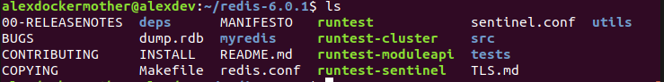
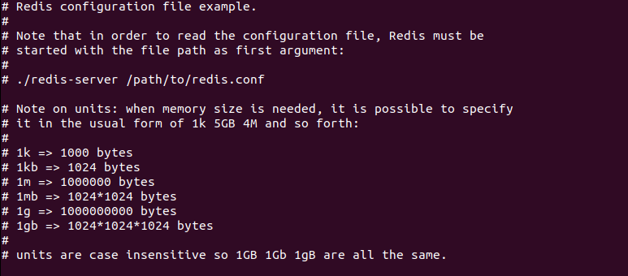
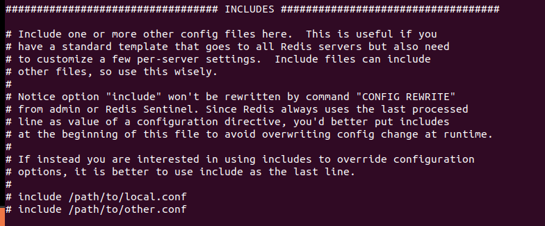
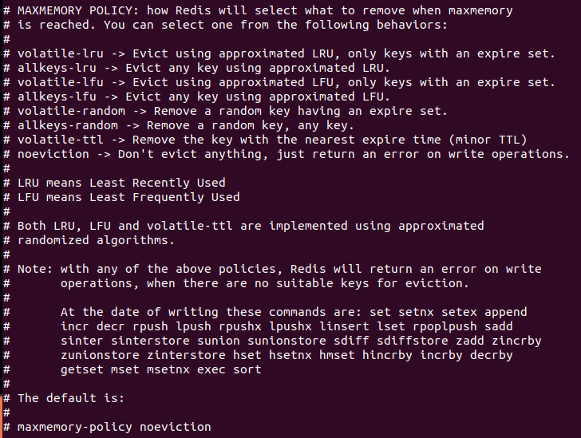

# redis.config分析

## 它在哪

## 单位

1. 配置大小单位，开头定义了一些基本的度量单位，只支持bytes，不支持bit
2. 对大小写不敏感

## INCLUDES包含

可以通过includes包含其他的配置文件，redis.conf可以作为总闸，包含其他

## GENERAL通用

- daemonize

    Redis默认不是以守护进程的方式运行，可以通过该配置项修改，使用yes启用进程

- pidfile

    当Redis以守护进程方式运行时，Redis会默认会把pid写入/var/run/redis.pid，可以通过profile指定

- port
- tcp-backlog

    设置tcp的backlog，backlog其实是一个连接队列，backlog队列总和=未完成三次握手队列 + 已经完成三次握手队列。
    在高并发环境下你需要一个高backlog值来避免慢客户端连接问题。注意Linux内核会将这个值减小到/proc/sys/net/core/somaxconn的值，所以需要确认增大somaxconn和tcp_max_syx_backlog两个值来达到想要的效果

- bind ip
- timeout (0代表不关闭)
- tcp-keepalive

    单位为秒，如果设置为0,则不会进行keepalive检测，建议设置成60

- loglevel
- logfile
- syslog-enabled是否把日志输出到syslog中
- syslog-ident 指定syslog里的日志标志
- 指定syslog设备 值可以是USER或LOCAL0～LOCAL7
- databases

## SNAPSHOTTING快照

## REPLICATION复制

## SECURITY安全

## LIMITS限制

### MaxMemory Policy

当到达最大缓存使得处理策略

    LRU - Least Recently Used
    TTL - time to leave

- Volatile-lru 使用LRU算法移除key,只对设置了过期时间的键
- Allkeys-lru 使用LRU算法移除key
- Volatile-random 在过期集合中移除key，只对设置了过期时间的键
- Allkeys-random 移除随机的key
- Volatile-ttl 移除那些TTL值最小的key, 即那些最近要过期的key
- Noevication 永不过期 不进行移除。针对写操作，只是返回错误信息

### Maxmemory-samples

设置样本数量，LRU算法和最小TTL算法都并非是精确的算法，而是估算值，所以你可以设置样本的大小。
redis会默认检查这么多个key并选择其中LRU的那个

## APPEND ONLY MODE追加
