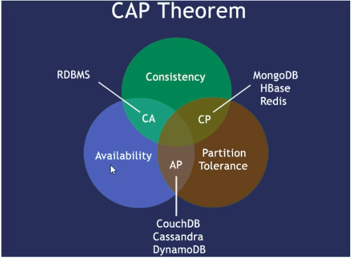

# 笔记

## 大数据时代的3V

- 海量Volumn
- 多样Variety
- 实时Velocity

## 互联网需求的3高

- 高并发
- 高可扩
- 高性能

## NoSQL数据模型

1. 以一个电商客户、订单、订购、地址模型来对比下关系型数据库和非关系型数据库

    - 传统的关系型数据库如何设计？ ER图（1：1/1：N/ N：N，主外键等常见）

    - NoSQL如何设计？ 什么是BSON？ BSON（）是一种类json的一种二进制形式的存储格式，简称Binary JSON。它和JSON一样，支持内嵌的文档对象和数组对象

2. 聚合模型

***高并发的操作不太建议用关联查询，互联网公司用冗余数据来避免关联查询***

***分布式事务是支持不了太多的并发的***
    - KV 键值
    - Bson
    - 列族
        顾名思义，是按列存储数据的。最大的特点是方面存储结构化和半结构化数据，方便做数据压缩，对针对某一列或者某几列的查询有非常大的IO优势。
    - 图形

## NoSQL数据库的四大分类

- KV键值
    1. 新浪： BerkeleyDB + redis
    2. 美团： redis + tair
    3. 阿里、百度： memcache + redis
- 文档型数据库（bson格式比较多）
    1. CouchDB
    2. MongoDB
- 列存储数据库
    1. Cassandra, HBase
    2. 分布式文件系统
- 图存储数据库
    1. 专注于构建关系图谱
    2. Neo4J, InfoGrid
- 四者对比
    |分类|Examples举例|典型应用场景|数据模型|优点|缺点|
    |---|------------|----------|------|---|----|
    |键值（key-value）|Tokyo Cabinet/Tyrant, Redis, Voldemort, Oracle BDB|内容缓存，主要用于处理大量数据的高访问负载，也用于一些日志系统等等|Ke指向Value的键值对，通常用hash table 来实现|查找速度快|数据无结构化，通常只被当作字符串或者二进制数据|
    |列存储数据库|Cassandra, HBase, Riak|分布式的文件系统|以列簇式存储，将同一列数据存在一起|查找速度快，可扩展性强，更容易进行分布式扩展|功能相对局限|
    |文档型数据库|CouchDB, MongoDB|Web应用（与Key-value类似，value是结构化的，不同的是数据库能够了解Value的内容）|key-value对应的键值对，Value为结构化数据|数据结构要求不严格，表结构可变，不需要像关系行数据库一样需要预先定义表结构|查询性能不高，而且缺乏统一的查询语言|
    |图形数据库|Neo4J, InfoGrid, Infinite Graph|社交网络，推荐系统等。专注于构建关系图谱|图结构|利用图结构相关算法。比如最短路径寻址，N度关系查找等|很多时候需要对图做计算才能得出需要的信息，而且这种结构不太好做分布式的集群方案|

## 分布式数据库中CAP原理CAP+BASE

### 传统的ACID

- Atomicity
- Consistency
- Isolation
- Durabiliy

### CAP

- Consistency 强一致性
- Avaliablity 可用性
- Partition torlerance 分区容错性

### CAP的3进2

    CAP理论就是说在分布式存储系统中，最多只能实现上面的亮点。而由于当前的网络硬件肯定会出现延迟丢包的等问题，所以：

    分区容忍性是我们必须要实现的。

    所以我们只能在一致性和可用性之间进行权衡，没有NoSQL系统能同时保证这三点。

    CA - 传统Oracle数据库
    AP - 大多数网站架构的选择
    CP - Redis, Mongodb

### 经典CAP图

    - CAP核心理论：一个分布式系统不可能同时很好的满足一致性，可用性和分区容错性这三个需求，***最多只能同时较好的满足两个***。
    - 因此，根据CAP原理将NoSQL数据库分成了满足CA原则，满足CP原则和满足AP原则三大类：
        1. CA - 单点集群，满足一致性，可用性的系统，通常在可扩展性上不太强大。
        2. CP - 满足一致性，分区容忍性的系统，通常性能呢个不是特别高
        3. AP - 满足可用性，分区容忍性的系统，通常可能对一致性要求低一些。

### BASE

    BASE就是为了解决关系数据库强一致性引起的问题而引起的可用性降低而提出的解决方案。
    BASE其实是下面三个术语的缩写：
        - 基本可用 Basically Available
        - 软状态 Soft state
        - 最终一致 Eventually consistent
    它的思想就是通过让系统放松对某一时候数据一致性的要求来换取系统整体伸缩性和性能上改观。为什么这么说呢，缘由就在于大型系统往往由于地域分布和极高性能要求，不可呢能采用分布式事务来完成这些指标，要想获得这些指标，我们必须采用另外一种方式来完成，这里BASE就是解决这个问题的方法。    

### 分布式+集群简介

    1. 分布式：不同的多台服务器上面部署不同的服务模块（工程），他们之间通过Rpc/Rmi之间通信和调用，对外提供服务和组内协作
    2. 集群：不同的多台服务器上面部署相同的服务模块，通过分布式调度软件进行统一的调度，对外提供服务和访问。